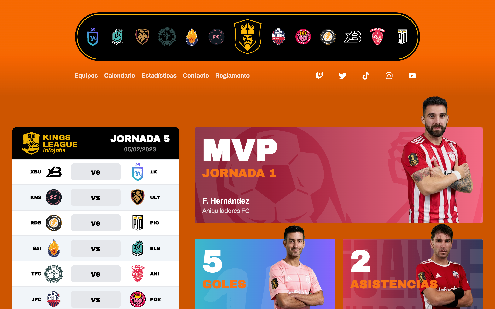
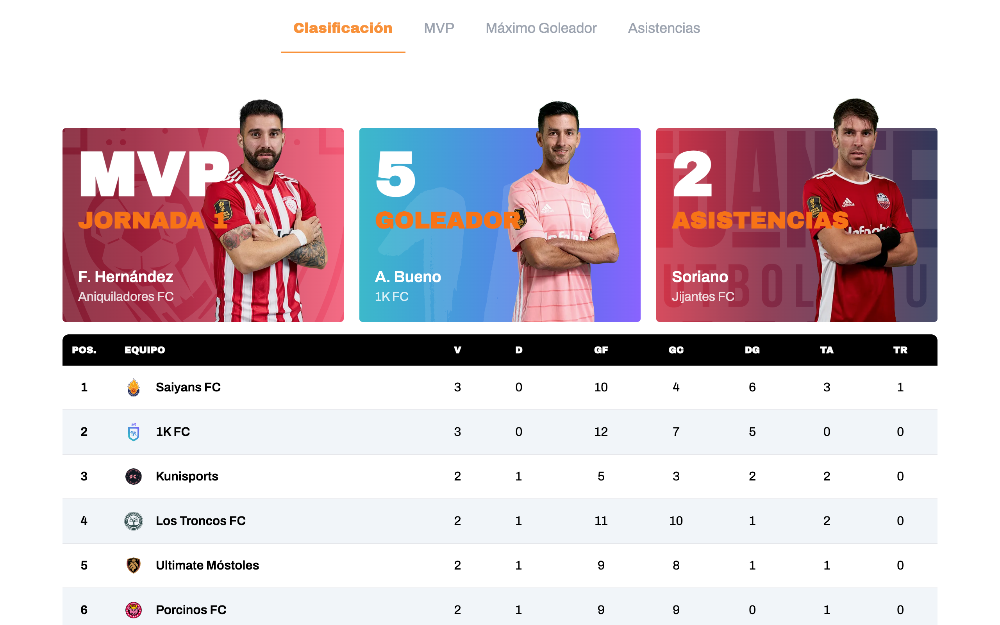
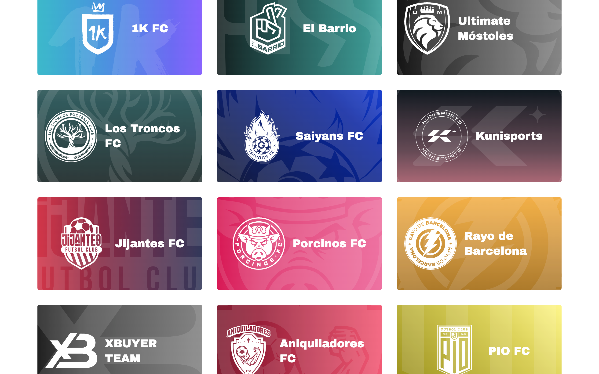

  <h1>Kings League Project</h1>

Este repositorio tiene como objetivo seguir paso a paso el desarrollo full stack creado por [midudev](https://midu.dev) en su canal de [twitch](https://www.twitch.tv/midudev/). <a href="https://github.com/midudev/kings-league-project">Aquí puedes encontrar el repositorio original</a>

